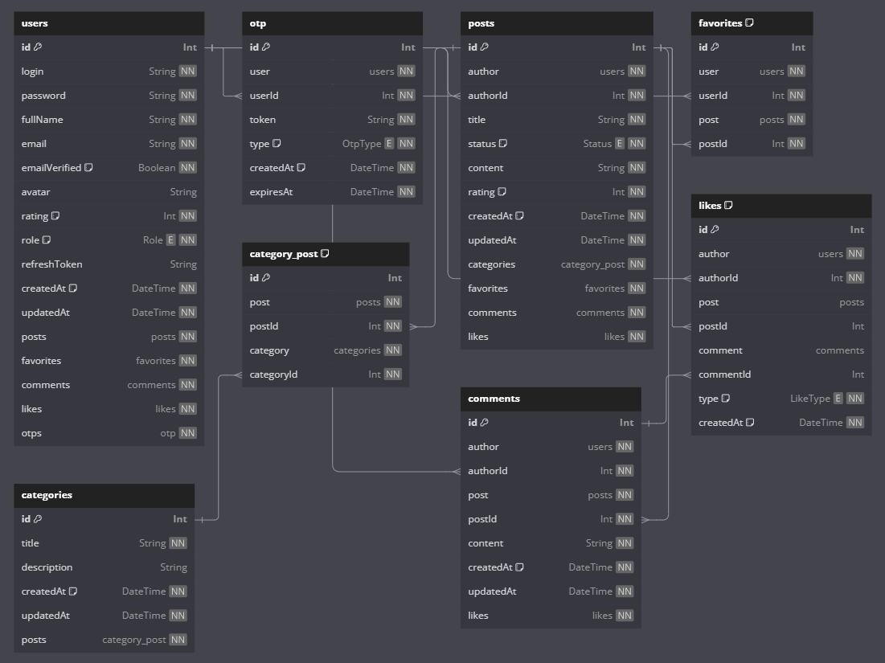

# **TellMe**

<div>
    
    
    
    
    
    
    
    
    
    
    
    
</div>

---

**TellMe** is an application inspired by platforms like StackOverflow and Reddit. It provides an API for user authentication, posting, commenting and likes. The project is designed for learning and experimentation purposes and demonstrates the use of modern backend development practices.

---

## 📋 Table of Contents

- [⚡️ Getting Started](#getting-started)
  - [📋 Prerequisites](#prerequisites)
  - [⚙️ Installation](#installation)
  - [🗂 Database Setup](#database-setup)
  - [🚀 Executing program](#executing-program)
- [📄 API Documentation](#api-documentation)
- [🔐 Admin panel](#admin-panel)
- [📝 Database Schema](#database-schema)
- [🧾 License](#license)

---

## <a name="getting-started">⚡️ Getting Started</a>

### <a name="prerequisites">📋 Prerequisites</a>

Ensure you have the following installed:

- [Node.js](https://nodejs.org/en) (v16 or higher)
- [npm](https://www.npmjs.com) (v7 or higher)
- [PostgreSQL](https://www.postgresql.org) (v12 or higher)

### <a name="installation">⚙️ Installation</a>

1. Clone the repository:

   ```bash
   git clone https://github.com/Prov258/usof.git
   ```

### <a name="server">⚙️ Server</a>

1. Go to the project directory:

   ```bash
   cd usof/backend
   ```

2. Install dependencies:

   ```bash
   npm install
   ```

3. Create a `.env` file based on `.env.example` and put your configuration values

### <a name="database-setup">🗂 Database Setup</a>

1. Configure the database:
   - Create a PostgreSQL database
   - Set up the environment variables in a `.env` file
2. Run the database migrations:

   ```bash
   npx prisma migrate dev
   ```

3. Seed the database if needed:

   ```bash
   npx prisma db seed
   ```

### <a name="executing-server">🚀 Executing server</a>

To run the server use the following command:

```bash
npm run start
```

### <a name="client">⚙️ Client</a>

1. Go to the frontend directory:

   ```bash
   cd frontend/
   ```

2. Install dependencies:

   ```bash
   npm install
   ```

3. Create a `.env` file based on `.env.example` and put your configuration values

4. To run the client use the following command:

```bash
npm run dev
```

Once the client is launched, you can access the application at `http://localhost:5173/`.

## <a name="api-documentation">📄 API Documentation</a>

The application uses Swagger for API documentation.\
Visit `http://localhost:3000/api/docs` in your browser after starting the server to view the interactive API documentation.

## <a name="admin-panel">🔐 Admin panel</a>

After starting the server you can visit admin panel at `http://localhost:3000/admin`. After the database seeding the application comes with default admin credentials:

- **Email**: `admin@example.com`
- **Password**: `password`

## <a name="database-schema">📝 Database Schema</a>

The database schema is managed using Prisma. Below is a visual repesentation of the schema:

<p align="center">
  
</p>

## <a name="license">🧾 License</a>

This project is licensed under the [MIT License](http://opensource.org/licenses/MIT).
